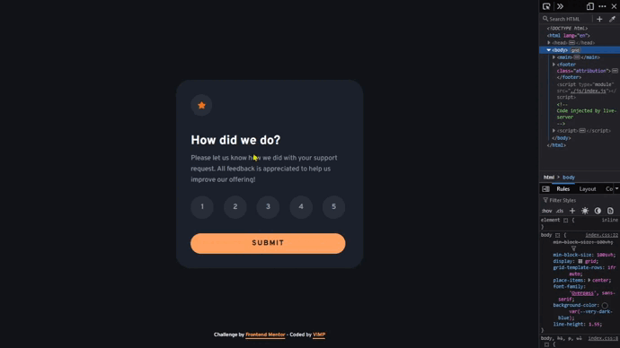

# Frontend Mentor - Interactive rating component solution

This is a solution to the [Interactive rating component challenge on Frontend Mentor](https://www.frontendmentor.io/challenges/interactive-rating-component-koxpeBUmI).  
Frontend Mentor challenges help you improve your coding skills by building realistic projects. 

🔳 [The challenge](#the-challenge-nerd_face)

🔳 [Screenshots](#screenshots-camera)

🔳 [Links](#links-link)

🔳 [Built with](#built-with-hammer_and_pick)

🔳 [Author](#author-beginner)

## *The challenge* :nerd_face:

Users should be able to:

🎯 View the optimal layout for the app depending on their device's screen size.

🎯 See hover states for all interactive elements on the page.

🎯 Select and submit a number rating.

🎯 See the "Thank you" card state after submitting a rating.

## *Screenshots* :camera:

## *Links* :link:

[Live site URL](https://mendezpvi.github.io/fm-interactive-rating/) 👀

[Challenges overcome](https://github.com/mendezpvi/frontend-mentor-challenges) 👀

[Solution in Frontend Mentor](https://www.frontendmentor.io/solutions/interactive-rating-component-Nmp9im1c0f) 👀

## *Built with* :hammer_and_pick:

✅ Semantic HTML5 markup

✅ CSS custom properties

✅ Grid CSS

✅ Vanilla JavaScript

✅ Mobile-first workflow

## *Author* :beginner:

✨ Frontend Mentor - [@mendezpvi](https://www.frontendmentor.io/profile/mendezpvi)
